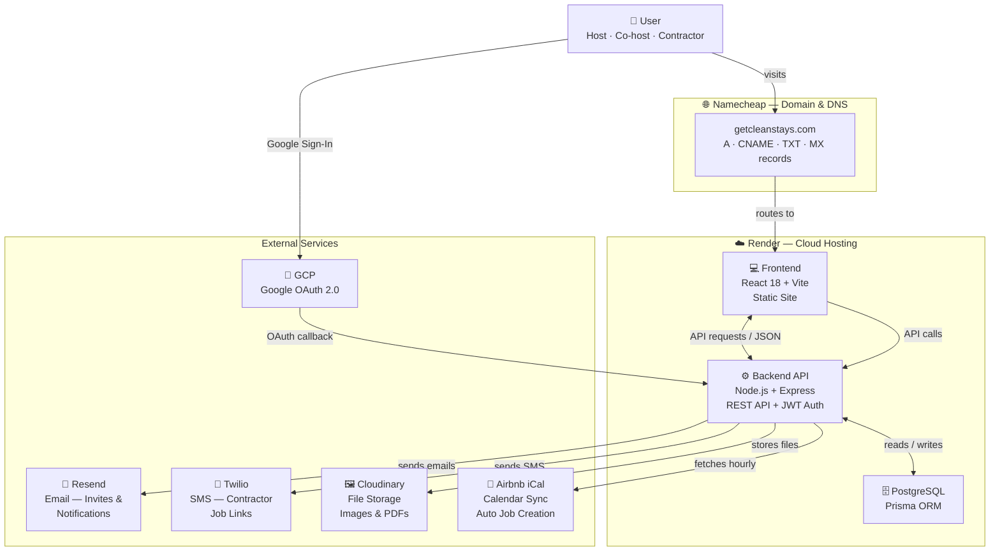

# 🧹 CleanStay

**Property management platform for short-term rental hosts.**
Manage cleaning jobs, maintenance tasks, co-hosts, and contractors — all in one place.

🌐 **Live:** [getcleanstays.com](https://getcleanstays.com)

---

## System Architecture



---

## Features

| Feature | Description |
|---|---|
| 🏠 **Listings** | Create and manage short-term rental properties with iCal sync |
| 📋 **Cleaning Jobs** | Auto-generated from Airbnb bookings — room-by-room checklists |
| 🔧 **Maintenance Tasks** | One-time or recurring tasks with attachments, assignments, and due dates |
| 👥 **Co-hosts** | Invite co-hosts by email with role-based access (manage or view-only) |
| 📲 **Contractors** | Send unique SMS job links — no app login required |
| 🔐 **Auth** | Email/password or Google Sign-In (OAuth 2.0) |
| ⚙️ **Admin Dashboard** | Platform-wide stats, user and listing management |
| 📅 **Calendar View** | See all jobs across listings in a unified calendar |

---

## Tech Stack

| Layer | Technology |
|---|---|
| Frontend | React 18 + Vite |
| Backend | Node.js + Express |
| Database | PostgreSQL + Prisma ORM |
| Auth | JWT + Google OAuth (GCP) |
| Hosting | Render (frontend, API, database) |
| Domain / DNS | Namecheap |
| Email | Resend |
| SMS | Twilio |
| File Storage | Cloudinary |
| Calendar Sync | Airbnb iCal |

---

## Getting Started

### 1. Clone & install

```bash
# Backend
cd server && npm install

# Frontend
cd client && npm install
```

### 2. Environment variables

**`server/.env`**
```env
PORT=5000
DATABASE_URL=postgresql://...
JWT_SECRET=your_secret

# Google OAuth
GOOGLE_CLIENT_ID=...
GOOGLE_CLIENT_SECRET=...
GOOGLE_CALLBACK_URL=http://localhost:5000/api/auth/google/callback

# Email (Resend)
RESEND_API_KEY=re_...
RESEND_FROM=noreply@yourdomain.com

# SMS (Twilio)
TWILIO_ACCOUNT_SID=AC...
TWILIO_AUTH_TOKEN=...
TWILIO_PHONE=+1...

# File uploads (Cloudinary)
CLOUDINARY_CLOUD_NAME=...
CLOUDINARY_API_KEY=...
CLOUDINARY_API_SECRET=...

# App URLs
CLIENT_URL=http://localhost:5173
ADMIN_EMAIL=you@example.com
```

### 3. Run

```bash
# Terminal 1 — backend
cd server && npm run dev

# Terminal 2 — frontend
cd client && npm run dev
```

Frontend: `http://localhost:5173` · API: `http://localhost:5000`

---

## Key Flows

**iCal Sync**
1. Paste your Airbnb iCal URL into a listing
2. Backend fetches it every hour (or on-demand via "Sync iCal")
3. Each guest checkout date → auto-creates a Cleaning Job for all rooms

**Contractor Assignment**
1. Click "Assign" on a Cleaning Job → select a saved contractor
2. Twilio sends them a unique SMS link
3. Contractor opens link (no login needed) → checks off rooms
4. Job status updates in real time

**Co-host Invite**
1. Click "👥 Invite" on a listing → enter email + role
2. Resend delivers a branded invite email
3. Invitee accepts → listing appears in their dashboard

---

## Docs

- `docs/generate_architecture_pdf.py` — generates a detailed architecture PDF
  Run with: `python3 docs/generate_architecture_pdf.py`

---

## User Roles

| Role | Capabilities |
|---|---|
| **Host** | Full access — create listings, manage jobs, invite co-hosts, assign contractors |
| **Co-host** | Manage or view-only access depending on assigned role |
| **Contractor** | Access jobs via SMS link only — no account required |
| **Admin** | Platform-wide dashboard (set via `ADMIN_EMAIL` env var) |
